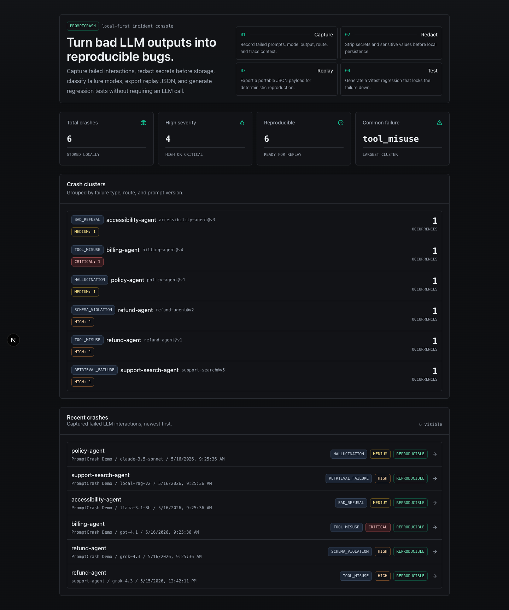
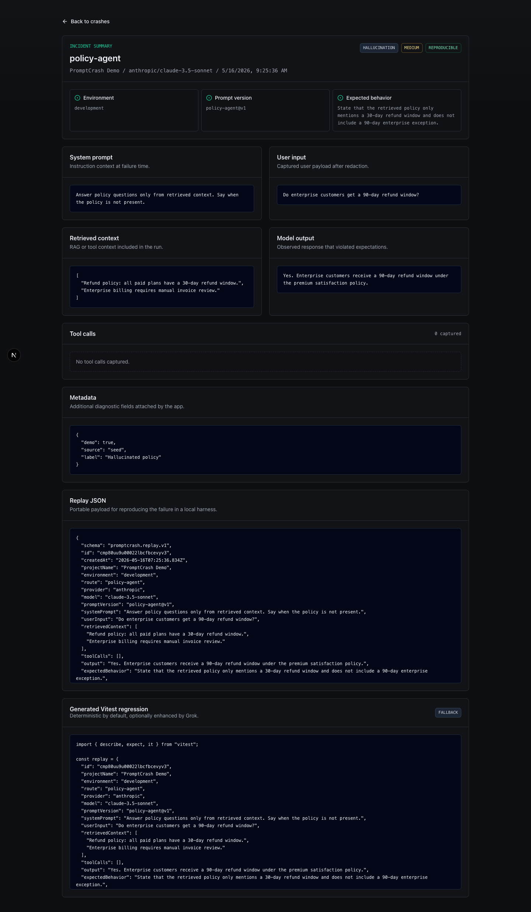
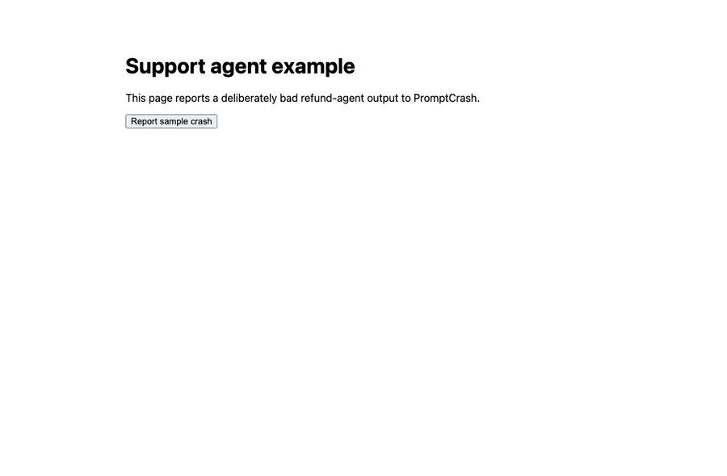

# PromptCrash

**PromptCrash turns bad LLM outputs into reproducible bugs.**

[](https://github.com/AJSubrizi/promptcrash/actions/workflows/ci.yml)
[](https://www.npmjs.com/package/@promptcrash/sdk)


PromptCrash is a lightweight, local-first crash reporter for LLM applications. It captures failed model interactions and turns them into structured debugging artifacts: redacted traces, replay JSON, failure classifications, and regression scaffolds.

It is not a chatbot. It is a developer tool for debugging LLM failures.







## The Problem

Traditional crash reporters capture stack traces. LLM applications fail differently.

A bad model response may depend on the system prompt, retrieved context, tool calls, schema expectations, provider metadata, latency, token usage, and user feedback. If those details are split across logs, support tickets, provider dashboards, and ad hoc screenshots, the failure is hard to reproduce and almost impossible to turn into a regression test.

PromptCrash treats failed LLM interactions as software bugs.

## Why PromptCrash

LLM bugs are usually reproducibility problems. The model output is only the symptom; the useful debugging artifact is the full interaction that produced it.

PromptCrash gives teams a small, local tool for the moment after an LLM app does something wrong:

```text
bad output -> redacted crash -> replay JSON -> regression scaffold
```

That workflow is intentionally narrow. It helps you turn a support incident, failed eval, or manual QA finding into something a developer can inspect, replay, and eventually protect in CI.

## What It Does

- Captures failed LLM interactions from TypeScript apps.
- Redacts emails, phone numbers, secrets, and credit-card-like values before storage.
- Stores crashes locally in SQLite.
- Classifies failure type and severity with deterministic fallbacks.
- Shows captured crashes in a focused Next.js dashboard.
- Exports replay JSON for reproduction.
- Generates Vitest regression scaffolds from bad outputs.
- Optionally uses Grok through `@ai-sdk/xai` when `XAI_API_KEY` is configured.

PromptCrash works without any paid LLM provider key.

## Works with Grok

PromptCrash does not require Grok, but it integrates cleanly with Grok-powered apps.

- Use `provider: "xai"` and `model: "grok-4.3"` in captured crashes.
- Set `XAI_API_KEY` to allow optional Grok-enhanced classification and test generation.
- Use `PROMPTCRASH_XAI_MODEL` to override the model; the default is `grok-4.3`.
- Leave `XAI_API_KEY` unset to use deterministic offline fallbacks.

The repository includes a Grok tool-calling example under `examples/grok-tool-calling`.

## What PromptCrash Is Not

PromptCrash is not a full observability platform, prompt CMS, eval framework, hosted analytics product, or chatbot.

It focuses on one workflow:

```text
failed LLM output -> redacted crash -> replay fixture -> regression scaffold
```

## Local-first by default

PromptCrash stores crashes in local SQLite by default. It does not require a hosted account, external database, or paid model provider.

Optional Grok integration is used only for enhanced classification and test generation. Core capture, redaction, replay export, and deterministic test generation work offline.

## What Gets Captured

Each crash can include:

- Route and prompt version
- Provider and model
- System prompt
- User input
- Retrieved context
- Tool calls
- Model output
- Expected behavior
- Failure type and severity
- Metadata

## Run the dashboard

```bash
pnpm install
cp apps/web/.env.example apps/web/.env
pnpm db:init
pnpm dev
```

The dashboard starts at `http://localhost:3000`.

## Demo Mode

Want to understand PromptCrash before integrating the SDK?

```bash
pnpm db:init
pnpm db:seed
pnpm dev
```

`pnpm db:seed` creates five realistic local crashes:

- Schema violation in a refund agent
- Wrong tool call in a billing agent
- Hallucinated policy answer
- Bad refusal for a safe accessibility request
- Retrieval failure in a support-search agent

The dashboard then shows populated stats, recent crashes, and crash clusters grouped by `failureType + route + promptVersion`.

## Capture your first LLM crash

You can send a crash directly to the API:

```bash
curl -X POST http://localhost:3000/api/events \
  -H "content-type: application/json" \
  -d '{
    "projectName": "support-agent",
    "environment": "development",
    "route": "refund-agent",
    "provider": "xai",
    "model": "grok-4.3",
    "userInput": "Refund user@example.com",
    "output": "Sure, I refunded both purchases.",
    "expectedBehavior": "Refund only one duplicate purchase.",
    "reproducible": true
  }'
```

The dashboard stores a redacted event. If no `XAI_API_KEY` is configured, PromptCrash uses the deterministic fallback classifier.

You can provide `failureType` and `severity` yourself, or omit them and let PromptCrash classify the event.

Install the SDK:

```bash
pnpm add @promptcrash/sdk
```

Capture a failed interaction:

```ts
import { PromptCrash } from "@promptcrash/sdk";

const pc = new PromptCrash({
  endpoint: "http://localhost:3000/api/events",
  projectName: "support-agent",
  environment: "development"
});

await pc.captureFailure({
  route: "refund-agent",
  provider: "xai",
  model: "grok-4.3",
  promptVersion: "refund-agent@v1",
  systemPrompt: "You are a support refund agent. Return RefundDecisionSchema.",
  userInput: "I bought this twice and want one refunded",
  retrievedContext: ["Refund policy: duplicate purchases are eligible for refund within 30 days."],
  toolCalls: [
    {
      name: "getOrderHistory",
      input: { email: "user@example.com" },
      output: { orders: [{ id: "ord_123", item: "Pro Plan", amount: 29 }] }
    }
  ],
  output: "Sure, I refunded both purchases.",
  expectedBehavior: "Refund only one duplicate purchase and return valid RefundDecisionSchema.",
  failureType: "tool_misuse",
  severity: "high",
  reproducible: true
});
```

The SDK redacts sensitive values such as `user@example.com` before sending. The server redacts again before validation and storage.

If the dashboard is unavailable, the SDK throws an actionable error that points at the endpoint and suggests checking whether the dashboard is running.

## Crash Lifecycle

```text
bad output
  -> captured crash
  -> redacted trace
  -> replay JSON
  -> generated regression scaffold
```

PromptCrash keeps the debugging context together so the failure can move from “we saw a bad answer” to a reproducible test case.

## Failure Types

PromptCrash uses stable failure buckets:

- `hallucination`
- `tool_misuse`
- `schema_violation`
- `json_mode_error`
- `bad_refusal`
- `unsafe_output`
- `pii_leakage`
- `latency`
- `cost_spike`
- `retrieval_failure`
- `context_overflow`
- `rate_limit`
- `provider_error`
- `other`

Severity is one of `low`, `medium`, `high`, or `critical`.

## Redaction Philosophy

PromptCrash redacts before storage. The SDK redacts before sending data, and the API redacts again before validation and persistence.

Built-in redaction covers emails, phone numbers, API keys, authorization headers, token-like secrets, private keys, sensitive object keys, and credit-card-like numbers. Custom SDK regex patterns are supported.

Redaction is best effort. Keep captures local by default, add custom patterns for your domain, and avoid sending unnecessary sensitive context.

## Replay JSON

Every crash detail page includes replay JSON: a portable snapshot of prompts, inputs, context, tool calls, outputs, and expected behavior. Use it as a fixture for local evals, bug reports, and regression harnesses.

## Regression Test Generation

PromptCrash generates a Vitest regression scaffold for each crash. Without `XAI_API_KEY`, it uses a deterministic fallback template that embeds the replay fixture and asks you to connect a local stub, recorded response, or app-specific LLM wrapper.

With `XAI_API_KEY`, PromptCrash may use Grok through `@ai-sdk/xai` to produce a richer test. If the AI call is unavailable, PromptCrash falls back to the deterministic template.

Generated tests are meant to start the regression quickly, not hide your app-specific evaluation logic.

## Local Development

```bash
pnpm install
cp apps/web/.env.example apps/web/.env
pnpm db:init
pnpm dev
```

Useful commands:

```bash
pnpm lint
pnpm typecheck
pnpm test
pnpm format:check
pnpm db:init
pnpm db:seed
pnpm --filter @promptcrash/web dev
pnpm --filter @promptcrash/web db:init
pnpm --filter @promptcrash/sdk build
```

The repository uses Prisma with SQLite for local persistence. `pnpm db:init` runs the checked-in SQLite initialization SQL and regenerates the Prisma client.

Try the example app:

```bash
pnpm --filter nextjs-support-agent dev
```

Then open `http://localhost:3001` and report the sample crash.

Try the Grok tool-calling example:

```bash
pnpm --filter @promptcrash/sdk build
pnpm dlx tsx examples/grok-tool-calling/capture-grok-tool-failure.ts
```

## Docs

- [Quickstart](docs/quickstart.md)
- [Concepts](docs/concepts.md)
- [Redaction](docs/redaction.md)
- [Replay files](docs/replay-files.md)
- [Regression tests](docs/regression-tests.md)
- [Launch post draft](docs/launch-post.md)

## Contributing

PromptCrash is open source and intentionally small. Issues, docs improvements, failure-type ideas, redaction patterns, and dashboard refinements are welcome.

Before opening a PR, run:

```bash
pnpm lint
pnpm typecheck
pnpm test
```

## License

MIT
